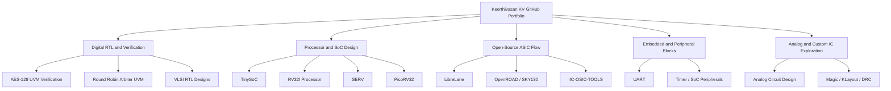

# 124107157-KV

> Profile README for Keerthivasan Palani

# Hi, I'm Keerthivasan Palani 👋

<p align="center">
  <strong>Digital IC Design · UVM Verification · FPGA/RTL · Open-Source ASIC Flows</strong>
</p>

<p align="center">
  <a href="https://github.com/124107157-KV">
    
  </a>
  
  
  
</p>

---

## About Me

I am an Electrical and Electronic Engineering postgraduate focused on **digital IC design, RTL implementation, hardware verification, FPGA prototyping, and open-source ASIC design flows**.

My work spans from writing synthesizable RTL blocks and UVM testbenches to running open-source RTL-to-GDS flows using SKY130, OpenROAD, Yosys, Magic, Netgen, KLayout, and LibreLane. I am especially interested in projects that connect **digital design, verification, computer architecture, embedded systems, and practical silicon implementation**.

---

## Core Technical Focus

| Area | Skills and Tools |
|---|---|
| RTL Design | Verilog, SystemVerilog, FSMs, datapaths, arbiters, UART, SoC blocks |
| Verification | UVM 1.2, constrained-random stimulus, monitors, scoreboards, functional coverage, assertions |
| Processor/SoC | RISC-V, SERV, PicoRV32, RV32I, custom CPUs, memory-mapped peripherals |
| ASIC Flow | SKY130, LibreLane, OpenROAD, Yosys, Magic, Netgen, KLayout |
| FPGA | PYNQ-Z2, Vivado, FPGA prototyping, waveform debug |
| Embedded Systems | UART, timers, microcontroller-style systems, C/Python scripting |
| Analog/Custom IC | SKY130 layout experiments, Magic TCL layout, DRC/LVS exploration |

---

## Featured Projects

### AES-128 Encryption Core with UVM Verification

A complete SystemVerilog/UVM verification project for an AES-128 cryptographic RTL core.

**Highlights**

- AES-128 encryption RTL core
- 128-bit plaintext, key, and ciphertext path
- Complete UVM environment with agent, driver, monitor, scoreboard, and coverage
- Directed and constrained-random stimulus
- Internal bit-exact AES-128 reference model in the scoreboard
- Functional coverage closure
- EPWave/VCD waveform debug
- EDA Playground compatible

**Verified Result**

| Metric | Result |
|---|---:|
| Transactions checked | 561 |
| Scoreboard result | 561 / 561 PASS |
| UVM errors | 0 |
| UVM fatals | 0 |
| Functional coverage | 99.82% |
| Coverage target | 90% |

Repository: [AES-128-Encryption-Core-with-UVM-Verification](https://github.com/124107157-KV/AES-128-Encryption-Core-with-UVM-Verification)

---

### Parameterized Round Robin Arbiter with UVM Verification

A compact but complete digital design and verification project demonstrating parameterized RTL and full UVM methodology.

**Highlights**

- Parameterized N-requester arbiter
- One-hot grant generation
- Rotating round-robin pointer
- Active-low reset
- Grant-valid protocol
- SystemVerilog assertions
- Directed tests for all request combinations
- Constrained-random request generation
- Scoreboard reference model
- Functional coverage
- EPWave waveform debug

Repository: [Parameterized-Round-Robin-Arbiter](https://github.com/124107157-KV/Parameterized-Round-Robin-Arbiter)

---

### TinySoC — 8-bit Microcontroller SoC on SKY130

A complete RTL-to-GDSII portfolio project using open-source ASIC tools.

**Highlights**

- Custom 8-bit accumulator CPU
- Data RAM
- Program ROM
- Memory-mapped UART
- Memory-mapped timer
- Simple SoC bus interconnect
- RTL simulation and linting
- Yosys synthesis
- OpenROAD floorplanning, placement, CTS, routing
- Magic DRC
- Netgen LVS
- KLayout final GDS inspection

Repository: [TinySoC](https://github.com/124107157-KV/TinySoC)

---

### RV32I Processor

A RISC-V RV32I processor project focused on digital architecture fundamentals.

**Relevant Areas**

- Instruction decode
- ALU design
- Register file
- Control logic
- Datapath design
- RTL simulation and debug

Repository: [RV32I_Processor](https://github.com/124107157-KV/RV32I_Processor)

---

### SERV and PicoRV32 Exploration

Repositories used to study compact RISC-V cores and processor implementation styles.

**Focus Areas**

- Bit-serial RISC-V architecture
- Small-area CPU design
- FPGA-friendly processor cores
- RISC-V datapath/control analysis
- Processor customization ideas

Repositories:

- [SERV](https://github.com/124107157-KV/SERV)
- [picorv32](https://github.com/124107157-KV/picorv32)

---

### Open-Source ASIC and EDA Flow Work

Repositories focused on learning, installing, documenting, and experimenting with open-source silicon design tools.

**Repositories**

- [awesome-opensource-asic-resources](https://github.com/124107157-KV/awesome-opensource-asic-resources)
- [awesome-opensource-hardware](https://github.com/124107157-KV/awesome-opensource-hardware)
- [IIC-OSIC-TOOLS](https://github.com/124107157-KV/IIC-OSIC-TOOLS)
- [OS_EDA_Tools_Install](https://github.com/124107157-KV/OS_EDA_Tools_Install)
- [Installation-of-open-source-analog-design-tools-with-sky130-PDK](https://github.com/124107157-KV/Installation-of-open-source-analog-design-tools-with-sky130-PDK)
- [librelane](https://github.com/124107157-KV/librelane)
- [open-silicon-lab](https://github.com/124107157-KV/open-silicon-lab)

**Focus Areas**

- SKY130 PDK setup
- IIC-OSIC-TOOLS
- LibreLane/OpenROAD experiments
- Magic/KLayout/Netgen flow setup
- Documentation of open-source IC design workflows

---

### RTL Building Blocks and Digital Design Practice

Repositories containing smaller RTL and digital systems exercises.

**Repositories**

- [VLSI_RTL_DESIGNS](https://github.com/124107157-KV/VLSI_RTL_DESIGNS)
- [UART](https://github.com/124107157-KV/UART)
- [tiny-gpu](https://github.com/124107157-KV/tiny-gpu)

**Focus Areas**

- UART design
- FSMs
- Datapath/control design
- RTL coding style
- Simulation and waveform debug

---

### Analog and Custom IC Exploration

Repository:

- [analog-circuit-design](https://github.com/124107157-KV/analog-circuit-design)

**Focus Areas**

- Analog circuit experiments
- SKY130 custom layout learning
- Magic layout scripting
- DRC-driven layout refinement

---

## Project Categories



---

## Repository Map

| Repository | Category | Main Skills Demonstrated |
|---|---|---|
| [AES-128-Encryption-Core-with-UVM-Verification](https://github.com/124107157-KV/AES-128-Encryption-Core-with-UVM-Verification) | UVM Verification | AES RTL, UVM, scoreboard, coverage closure |
| [Parameterized-Round-Robin-Arbiter](https://github.com/124107157-KV/Parameterized-Round-Robin-Arbiter) | UVM Verification | Arbiter RTL, SVA, UVM, coverage |
| [TinySoC](https://github.com/124107157-KV/TinySoC) | ASIC/SoC | RTL-to-GDS, SKY130, OpenROAD, SoC integration |
| [RV32I_Processor](https://github.com/124107157-KV/RV32I_Processor) | Processor Design | RISC-V, ALU, register file, control logic |
| [SERV](https://github.com/124107157-KV/SERV) | Processor Study | Bit-serial RISC-V, compact CPU architecture |
| [picorv32](https://github.com/124107157-KV/picorv32) | Processor Study | RISC-V core analysis |
| [UART](https://github.com/124107157-KV/UART) | RTL Peripheral | Serial communication, FSM, transmitter/receiver logic |
| [VLSI_RTL_DESIGNS](https://github.com/124107157-KV/VLSI_RTL_DESIGNS) | RTL Practice | Digital building blocks and RTL fundamentals |
| [tiny-gpu](https://github.com/124107157-KV/tiny-gpu) | Architecture Exploration | Parallel/datapath architecture exploration |
| [analog-circuit-design](https://github.com/124107157-KV/analog-circuit-design) | Analog/Custom IC | Circuit/layout exploration |
| [awesome-opensource-asic-resources](https://github.com/124107157-KV/awesome-opensource-asic-resources) | Resource Curation | ASIC resources and open-source references |
| [open-silicon-lab](https://github.com/124107157-KV/open-silicon-lab) | Silicon Lab | Open-source silicon workflow experiments |

---

## Verification Projects

### AES-128 UVM Verification

```text
test → env → agent → sequencer → driver → interface → DUT
                         monitor → scoreboard
                         monitor → coverage
```

Key verification features:

- `aes_item`
- `aes_rand_seq`
- `aes_corner_seq`
- `aes_driver`
- `aes_monitor`
- `aes_agent`
- `aes_scoreboard`
- `aes_coverage`
- `aes_env`
- `aes_test`

Latest documented outcome:

```text
Scoreboard: 561/561 PASS
Functional coverage: 99.82%
UVM_ERROR: 0
UVM_FATAL: 0
```

---

### Round Robin Arbiter UVM Verification

Key verification features:

- `arb_item`
- `arb_directed_seq`
- `arb_random_seq`
- `arb_driver`
- `arb_monitor`
- `arb_agent`
- `arb_scoreboard`
- `arb_coverage`
- `arb_env`
- `arb_test`

Design features:

```text
Parameterized requester count
One-hot grant
Rotating pointer
Grant-valid protocol
SVA checks
Functional coverage
```

---

## Skills Matrix

| Skill | Evidence |
|---|---|
| SystemVerilog RTL | AES-128, arbiter, UART, TinySoC, RV32I |
| UVM | AES-128 verification, round robin arbiter verification |
| Functional Coverage | AES 99.82% coverage, arbiter coverage model |
| Scoreboarding | AES reference model, arbiter pointer reference model |
| Assertions | Arbiter one-hot and protocol properties |
| RISC-V | RV32I, SERV, PicoRV32 |
| ASIC Flow | TinySoC, LibreLane, OpenROAD, SKY130 |
| Physical Verification | Magic DRC, Netgen LVS, KLayout |
| Embedded Peripherals | UART, timer, memory-mapped peripherals |
| Documentation | README-driven open-source project presentation |

---

## Current Learning and Build Direction

I am actively building a portfolio around:

- Digital IC design
- Design verification
- UVM methodology
- Processor and SoC design
- Open-source ASIC implementation
- FPGA/RTL prototyping
- Silicon-ready documentation

My preferred project style is **complete, reproducible, open-source friendly projects** with:

- Clean RTL
- Strong README documentation
- Verification results
- Coverage numbers
- Waveform screenshots
- Tool commands
- Design architecture explanation

---

## Contact

- GitHub: [124107157-KV](https://github.com/124107157-KV)
- Email: 124107157@umail.ucc.ie
- Name: Keerthivasan Palani

---

## Notes

This profile README is designed to highlight a hardware-focused GitHub portfolio. It emphasizes digital IC design, UVM verification, RISC-V exploration, and open-source ASIC flows rather than general software development.

